# Mermaid Diagrams

Render diagrams, schemas, and visual models as Mermaid code instead of ASCII art or plain prose. Mermaid renders natively in fenced ` ```mermaid ` code blocks in chat, Markdown files, and artifacts.

**Rule: never fall back to ASCII art or box-drawing characters for a diagram.** If a picture would help — flow, hierarchy, sequence, relationships, schedule, state — emit a ```mermaid``` block instead.

## Choosing a diagram type

| Need | Diagram type | Keyword |
|---|---|---|
| Process, decision flow, algorithm | Flowchart | `flowchart` |
| Interaction over time between actors/systems | Sequence diagram | `sequenceDiagram` |
| OOP structure, interfaces, inheritance | Class diagram | `classDiagram` |
| Finite state machine, lifecycle | State diagram | `stateDiagram-v2` |
| Database schema, data model | Entity-Relationship diagram | `erDiagram` |
| Project schedule, task dependencies | Gantt chart | `gantt` |
| Brainstorm, hierarchy of ideas | Mindmap | `mindmap` |
| Chronological events | Timeline | `timeline` |
| Proportions of a whole | Pie chart | `pie` |

## Flowchart

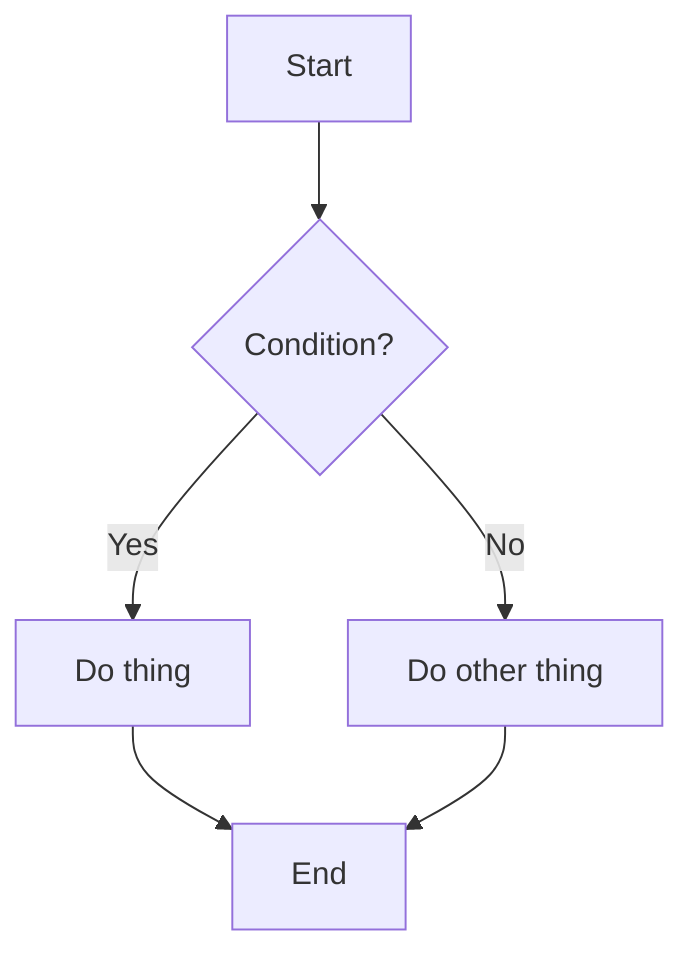

Direction: `TD`/`TB` (top-down), `BT` (bottom-up), `LR` (left-right), `RL` (right-left).

Node shapes:
```
A[Rectangle]        A(Rounded)         A([Stadium])
A{Diamond/decision}  A((Circle))        A[[Subroutine]]
A[(Database)]        A{{Hexagon}}       A>Asymmetric]
A[/Parallelogram/]   A[\Parallelogram\]
```

Edges:
```
A --> B          solid arrow
A --- B          open line, no arrow
A -->|Label| B   labeled arrow
A -.-> B         dotted arrow
A ==> B          thick arrow
A ~~~ B          invisible link (layout only)
A <--> B         bidirectional
```

Subgraphs (group nodes, e.g. layers or services):
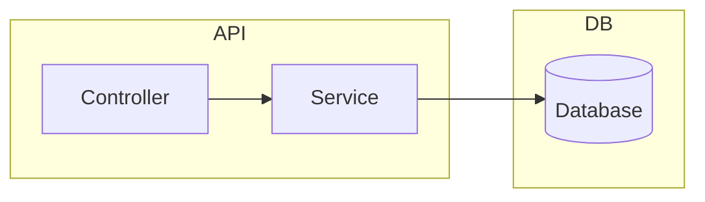

Styling:
```
style A fill:#f9f,stroke:#333,stroke-width:2px
classDef highlight fill:#f96,stroke:#333;
class A,B highlight;
```

## Sequence diagram

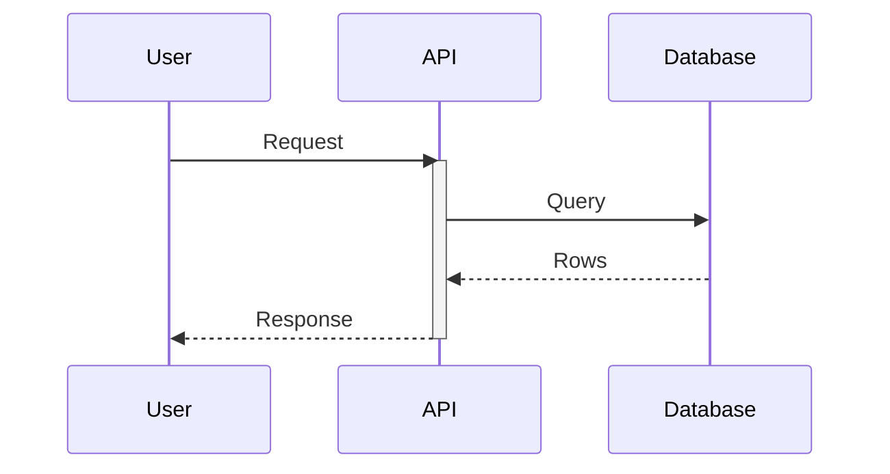

Arrow types: `->` solid no head, `-->` dotted no head, `->>` solid with head, `-->>` dotted with head, `-x`/`--x` cross (message failed), `-)`/`--)`  async.

Activation: `+` after the arrow activates the target, `-` deactivates (or use `activate`/`deactivate` explicitly).

Control blocks:
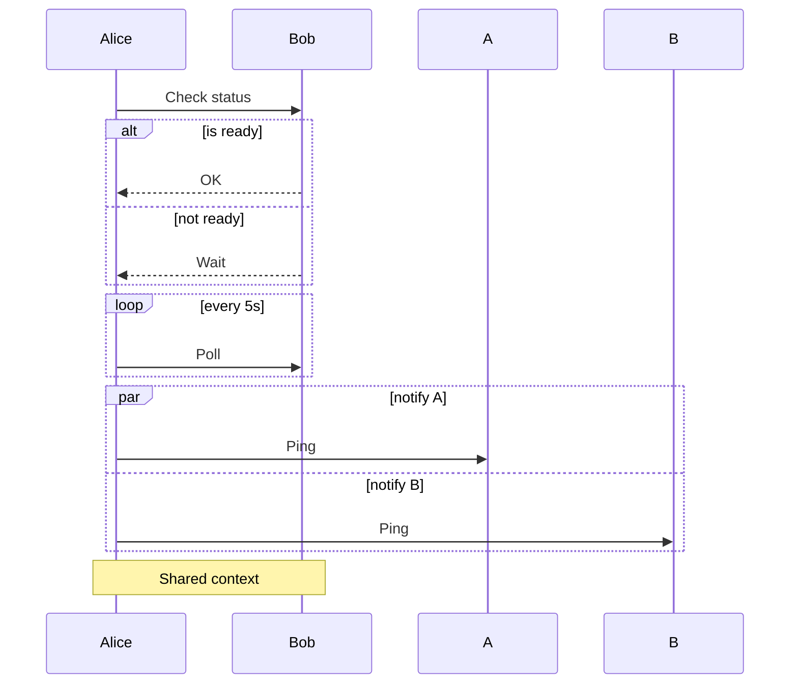

## Class diagram

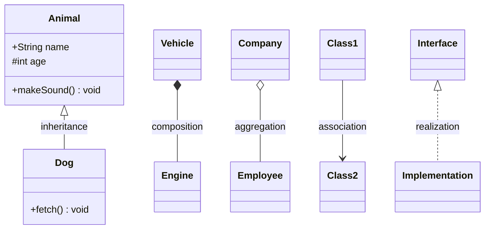

Visibility: `+` public, `-` private, `#` protected, `~` package.

Relationships: `<|--` inheritance, `*--` composition, `o--` aggregation, `-->` association, `..>` dependency, `..|>` realization, `--` link, `..` dashed link.

## State diagram

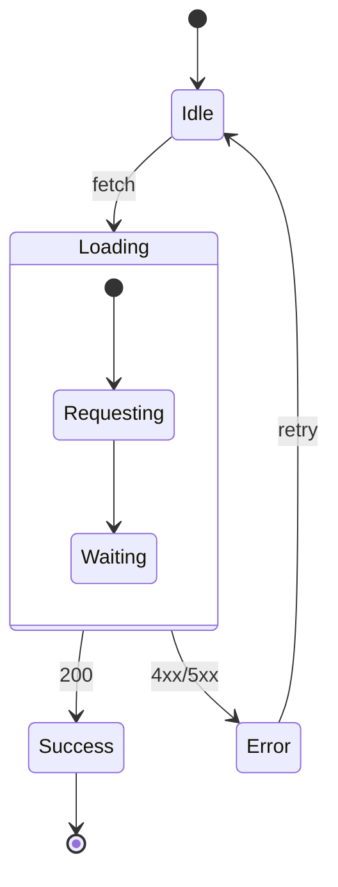

`[*]` marks start/end. Use `state "Long label" as X` to name a state with a longer description. `<<choice>>`, `<<fork>>`, `<<join>>` model branch/concurrency points.

## Entity-Relationship diagram

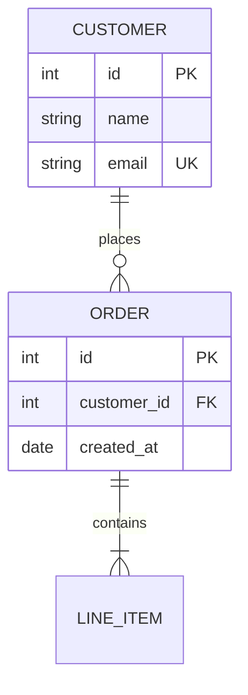

Cardinality markers (read left-to-right, near each entity):
```
|o  zero or one       o|
||  exactly one        ||
}o  zero or more       o{
}|  one or more        |{
```
Solid line (`--`) = identifying relationship, dashed line (`..`) = non-identifying.

## Gantt chart

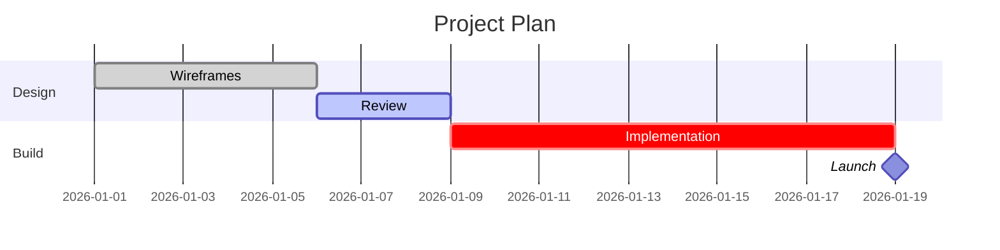

Status tags: `done`, `active`, `crit`, `milestone`. Dependencies via `after taskId` (space-separated for multiple). Durations: `d`, `w`, `M`, `h`.

## Mindmap

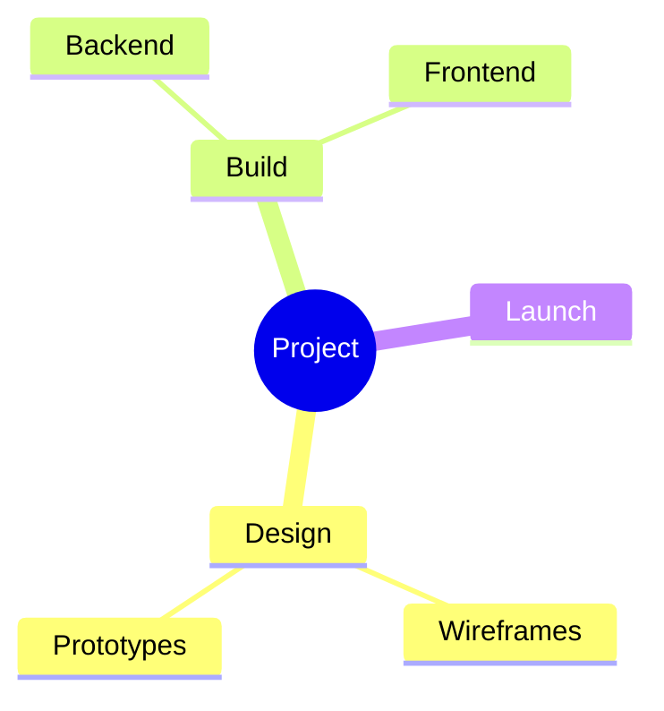

Shapes: `[Square]`, `(Rounded)`, `((Circle))`, `))Bang((`, `)Cloud(`, `{{Hexagon}}`. Hierarchy is indentation-based.

## Timeline

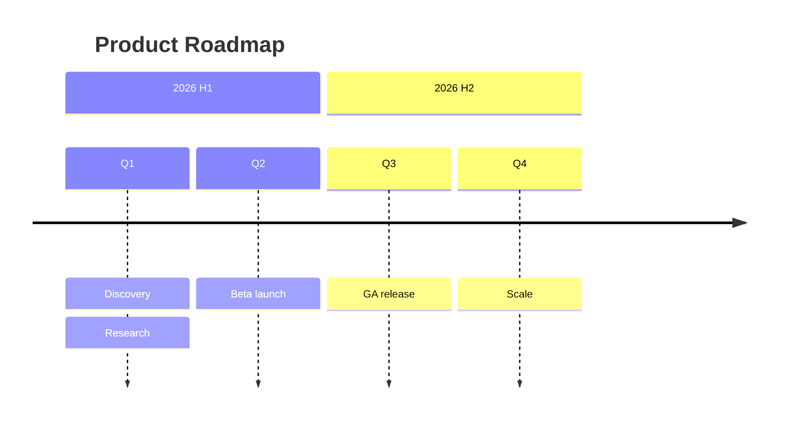

## Pie chart

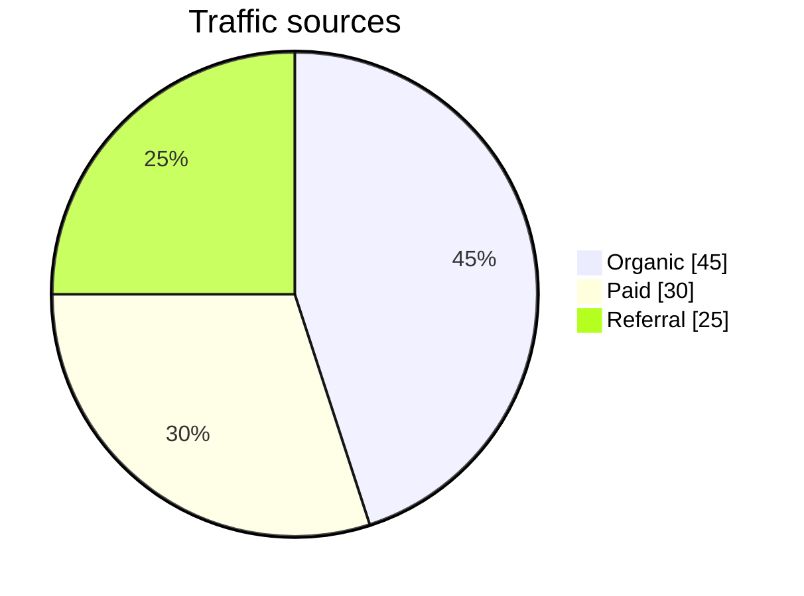

## General rules

- Always wrap Mermaid code in a fenced ` ```mermaid ` block — never ASCII boxes/arrows (`+---+`, `-->`, `|`) as a substitute for an actual diagram.
- Pick the diagram type from the table above based on what relationship is being shown (flow vs. time vs. structure vs. proportion), not by default to flowchart.
- Keep node/participant labels short; put detail in notes (`Note over ...`) or attribute blocks (ER) rather than cramming long text into a node.
- When targeting an Artifact, follow the `mermaid-diagrams`/`artifact-diagramming` skill rendering guidance for both light and dark themes.
- Validate syntax mentally against this reference before emitting; when unsure of an obscure feature, check https://mermaid.js.org/syntax/ for the specific diagram type rather than guessing.

## References

- [Mermaid tutorials](https://mermaid.js.org/ecosystem/tutorials.html)
- [Flowchart syntax](https://mermaid.js.org/syntax/flowchart.html)
- [Sequence diagram syntax](https://mermaid.js.org/syntax/sequenceDiagram.html)
- [Class diagram syntax](https://mermaid.js.org/syntax/classDiagram.html)
- [State diagram syntax](https://mermaid.js.org/syntax/stateDiagram.html)
- [ER diagram syntax](https://mermaid.js.org/syntax/entityRelationshipDiagram.html)
- [Gantt syntax](https://mermaid.js.org/syntax/gantt.html)
- [Mindmap syntax](https://mermaid.js.org/syntax/mindmap.html)
- [Timeline syntax](https://mermaid.js.org/syntax/timeline.html)
- [Pie chart syntax](https://mermaid.js.org/syntax/pie.html)
